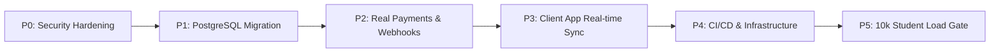

# 📋 Kraveo Ecosystem Master Production Audit & Remediation Roadmap

**Project Name:** Kraveo — Hyper-Local Campus Food Delivery Platform for VIT Bhopal  
**Audit Scope:** Full Monorepo (`backend/`, `apps/customer_app`, `apps/vendor_app`, `apps/driver_app`, `web/super_admin`)  
**Audit Date:** August 2026  
**Overall Readiness Score:** **22 / 100** (Polished UI Prototype / Live Demo Server — Not Production Ready)

---

## 📊 Executive Score Breakdown

```
┌─────────────────────────────────────────────────────────┐
│ UI / Demo Completeness       :  70 / 100  [███████░░░] │
│ Backend Production Readiness :  18 / 100  [██░░░░░░░░] │
│ Security Enforcement         :  10 / 100  [█░░░░░░░░░] │
│ End-to-End Real Integration  :  12 / 100  [█░░░░░░░░░] │
│ Operations & Reliability     :   8 / 100  [█░░░░░░░░░] │
│ ─────────────────────────────────────────────────────── │
│ OVERALL ECOSYSTEM SCORE      :  22 / 100  [██░░░░░░░░] │
└─────────────────────────────────────────────────────────┘
```

---

## 🏛️ Implemented vs. Intended Architecture Analysis

| Architectural Dimension | Documented Target Architecture | Currently Implemented Runtime Reality |
| :--- | :--- | :--- |
| **Data Persistence** | PostgreSQL 16 managed via Prisma ORM v5.22.0 | Volatile in-memory JavaScript objects (`backend/src/store.ts`) |
| **Authentication** | Secure JWT + Phone SMS OTP via MSG91/Twilio | Development OTPs (`1234`, `4829`) and caller-supplied role logins |
| **Payment Engine** | Razorpay SDK + Server Webhook Verification | Client-side simulated UPI dialog; backend marks orders `PAID` without PG confirmation |
| **Customer App** | End-to-end REST sync with cloud backend | Local hardcoded menu fallback and client-side timer status progression |
| **Vendor App** | Firebase Cloud Messaging push alerts & real-time queue | Sample order initialization & client UI-triggered order modal |
| **Driver App** | Background GPS streaming & server OTP verification | Hardcoded active order mock and local-only OTP regex check |
| **Super Admin** | Secure cloud API dashboard with RBAC guards | Hardcoded `localhost:5000` base URL fallback and client state persistence |
| **Transport Layer** | HTTPS / WSS SSL certificates behind Nginx reverse proxy | HTTP cleartext traffic at AWS EC2 IP (`http://3.110.189.80/api`), permissive CORS `*` |

---

## 🚨 Critical Launch Blockers & Technical Debt

### 1. Absence of Production Database Persistence
- **Finding**: The running backend Express server stores all state in JavaScript arrays and maps (`backend/src/store.ts:3`).
- **Impact**: Any server restart, crash, or PM2 reload completely wipes all registered users, vendors, orders, reviews, and driver locations.
- **Evidence**: `prisma/schema.prisma` exists and compiles, but `PrismaClient` is not instantiated or invoked in `backend/src/routes/api.ts`.

### 2. Simulated Payment & Verification Bypass
- **Finding**: Customer checkout displays "UPI Payment Successful" (`apps/customer_app/lib/screens/checkout_screen.dart:49`) without invoking Razorpay SDK or server checkout endpoints.
- **Impact**: Orders are marked `PAID` on creation (`backend/src/routes/api.ts:283`) without verified financial settlement.
- **Evidence**: Payment service (`backend/src/services/paymentService.ts:45`) returns success on mock signatures.

### 3. Authentication & RBAC Vulnerabilities
- **Finding**: Login endpoint accepts arbitrary phone numbers and user roles without verification (`backend/src/routes/api.ts:101`). Universal OTPs (`1234`, `4829`) are enabled.
- **Impact**: Unauthenticated users can toggle vendor open/closed statuses, edit dish prices (`/api/menus/:itemId/toggle`), or modify order states.
- **Evidence**: API mutation routes lack `authenticateToken` middleware and record ownership checks.

### 4. Client Application Desynchronization
- **Finding**: `customer_app`, `vendor_app`, and `driver_app` operate partially as standalone state machines rather than listening to centralized WebSocket/REST updates.
- **Impact**: A status change in `vendor_app` does not automatically update `customer_app` live tracking or notify `driver_app`.
- **Evidence**: `order_provider.dart:84` simulates order progression using a periodic local timer.

### 5. Insecure Transport & Environment Configuration
- **Finding**: Live cloud server responds over plain HTTP (`http://3.110.189.80/api`) with CORS set to `*`. Android manifests explicitly permit cleartext traffic (`android:usesCleartextTraffic="true"`).
- **Impact**: Sensitive user data, phone numbers, and hostel dropoff locations are transmitted unencrypted over campus Wi-Fi networks.
- **Evidence**: Android build configurations use debug signing keys and placeholder application IDs.

---

## 🛠️ P0–P5 Production Remediation Roadmap



### 🔴 Phase P0 — Security & Authentication Hardening
1. Remove development OTPs (`1234`, `4829`) and universal tokens from `backend/src/routes/api.ts`.
2. Bind real SMS gateway (MSG91 / Twilio) to OTP endpoints.
3. Configure HTTPS SSL certificates for domain `api.kraveo.in` and WSS for WebSockets.
4. Restrict Express CORS settings and apply `authenticateToken` + `requireRole` middleware to all mutation routes.

### 🟠 Phase P1 — Data Layer Persistence & Prisma ORM Migration
1. Replace `backend/src/store.ts` in-memory arrays with live `PrismaClient` calls to PostgreSQL 16.
2. Execute production database migration script (`prisma migrate deploy`).
3. Add payload validation (Zod) and rate limiting (`express-rate-limit`) on public API routes.

### 🟡 Phase P2 — Real Payment Processing & Server Gate OTP
1. Wire `apps/customer_app` checkout to native Razorpay Payment Gateway SDK.
2. Implement server-side webhook listener (`/api/payments/webhook`) to confirm UPI payment signatures before placing orders.
3. Encrypt and store Gate Handshake OTP on server; enforce server-side validation when driver completes delivery (`/api/orders/:id/verify-otp`).

### 🟢 Phase P3 — Client Ecosystem Synchronization & FCM Push
1. Integrate Firebase Cloud Messaging (FCM) into `apps/vendor_app` and `apps/driver_app` for background ringing alerts and job dispatches.
2. Implement real-time background location updates in `apps/driver_app`.
3. Update `web/super_admin` configuration to target `https://api.kraveo.in` instead of `localhost:5000`.

### 🔵 Phase P4 — Operational Infrastructure & Automated Testing
1. Configure GitHub Actions workflow for automated backend testing, Flutter analysis, and APK build generation.
2. Setup Sentry crash logging and PM2 process monitoring on AWS EC2.
3. Implement automated daily database snapshots and test backup restoration routines.

### 💜 Phase P5 — 10,000-Student Scale Gate
1. Conduct k6 load testing achieving <200ms p95 latency under 500 concurrent order placements.
2. Execute 7-day campus beta pilot across 2 highway dhabas and 100 student hostellers.
3. Verify 100% financial reconciliation between Razorpay payouts, platform commissions, and runner disbursements.
